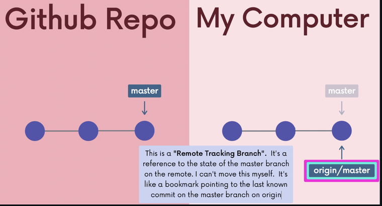

# Github 

**Q1**: How to clone a github repo ? 

**Solution**:

To clone a URL follow the steps 

- `git clone URL`

Example ➡️ `git clone https://github.com/pytorch/pytorch`

**Q2**: How to view remotes ? 

**Solution**:

- Viewing Remotes 
  - `git remote`
  - `git remote -v` ( v stands for verbose so it gives more information)

**Q3**: How to add a new remote ? 

**Solution**:

- Adding a new remote 
  - `git remote add <name> <URL>`
  - Example ➡️ `git remote add origin github.com/SuvadeepMukherjee/cute-cats-serverless`

**Q4**: How to rename a remote , removing a remotre ? 

**Solution**:

- Renaming a remote 
  - `git remote rename <old> <new>`
- Removing a remote 
  - `git remote remove <name>`

**Q5**: How to push our local master branch to the remote master branch ? 

**Solution**: 

- `git push <remote> <branch>`

Example ➡️ `git push origin master`

- The `-u` option 
  - The `-u` option allows us to set the upstream of the branch we are pushing
  - git push -u origin master` sets the upstream of the local master branch so that it tracks the master branch on the origin repo , next time we can use `git push

**Q6**: The default branch in Github is ___. The default branch in git is ____

**Solution**:

- Github has default branch as main
- git has default branch as master

**Q7**: What is a Remote Tracking branchj ? 

**Solution**:

- a reference to the state of a branch on the remote

Detailed Notes

- a reference to the state of a branch on the remote , we  can't move this ourself , at the time we last communicated with the  remote this is where the particular branch was referencing on the remote
- They follow this pattern remote/branch
- `origin/master` references the state of the master branch on the remote repo named origin
- `upstream/logoRedesign` references the state of the logoRedesign branch on the remote named upstream (a common remote name)

**Q8**: How can we view remote tracking branches ? 

**Solution**: `git branch -r`

**Q9**: How can we checkout on a remote tracking branch ? 

**Solution**: 

- `git checkout origin/master`

Note ➡️ This will put us in detached HEAD 

 

**Q10**: Which remote branch is automatically tracked when we clone a git repository ? 

**Solution**: 

- The local `master` branch is automatically set to track `origin/master`

**Q11**: Are remote branches tracked locally by default after cloning a Git repo ? 

**Solution**:

- No. Remote branches other than **origin/master** are **not tracked locally by default**.

**Q12**: How do you create a local branch that tracks a remote branch like `origin/puppies`

**Solution**:

- `git switch puppies`
- This creates a local `puppies` branch from `origin/puppies` and sets it to track that remote branch

**Q12**: Whats the difference between `fetch` and `pull` ? 

**Solution**:

|       | Definition                                                   |
| ----- | ------------------------------------------------------------ |
| fetch | Keeping Local Repo Up to Date (Without Merging) , Fetch does NOT change local branches or the working directory |
| pull  | go and download data from Github and immediately update my local repo with those changes, Changes are merged into the branch you are currently on |

**Q13**: Write the syntax? 

**Solution**:

| What it does ?                                               | Syntax                        |
| ------------------------------------------------------------ | ----------------------------- |
| fetch all the  branches from origin, updates all the remote tracking branches of origin | `git fetch`                   |
| fetch all the  branches from that specific remote, updates all the remote tracking branches of that particular remote | `git fetch <remote>`          |
| fetch a specific branch from the specific remote, updates the remote tracking branch of that particular branch | `git fetch <remote> <branch>` |
| pull all the changes from that particular branch of that remote and merge those chages into our local branch | `git pull <remote> <branch>`  |
| pull all the changes from the  branch(branch => whatever tracking connection is configured for our current local branch) of that remote and merge those chages into our local branch | `git pull <remote>`           |
| pull all the changes from the  branch(branch => whatever tracking connection is configured for our current local branch) of origin and merge those chages into our local branch | `git pull`                    |

**Q14**: `pr-conflict-practise` (High Priority)

- Create a git repo `pr-conflict-practise`

- Add a file `README.MD`

- Connect to Github  

- Add `suvadeep-ship-it` as a collaborator and open the github repo from `Suvadeep-ship-it` account

- From `suvadeep-ship-it`  account create a new branch `feature/add-line-from-b`

- Edit the README.MD to the following

  ```bash
   # Feature Branch Practice
  
    This line is added by Account B.
  
  ```

- Commit to branch:`feature/add-line-from-b`

- Open a  Pull Request from Account-B (suvadeep-ship-it)

- Create conflict on main (Account A , local), modify the same file locally 

  ```bash
  # Feature Branch Practice
  
  This line is added by Account A.
  ```

- Commit and push from main account 

- Confirm by opening the `pull-request` from main account github page and see that there are conflicts

- Resolve PR Conflict locally (Account A)

- Confirm the merge is completed 

**Solution**:

- Create a git repo `pr-conflict-practise` ➡️ `mkdir pr-conflict-practise` , `cd pr-conflict-practise` , `code .` , `git init`

- Add a file `README.MD` ➡️ Follow the instructions

- Connect to Github ➡️ Follow the instructions

- From `suvadeep-ship-it`  account create a new branch `feature/add-line-from-b` ➡️ Follow the instructions

- Edit the README.MD to the following ➡️ Follow the instructions

- Commit to branch:`feature/add-line-from-b` ➡️ Follow the instructions

- Open a  Pull Request from Account-B (suvadeep-ship-it) ➡️ Follow the instructions

- Create conflict on main (Account A , local), modify the same file locally  ➡️ Follow the instructions

- Commit and push from main account ➡️ Follow the instructions

- Confirm by opening the `pull-request` from main account github page and see that there are conflicts ➡️Follow the instructions

- Resolve PR conflict locally

  - Switch to the branch in question. Merge in main and resolve the conflicts

    ```
    git fetch origin 
    git switch feature/add-line-from-b
    git merge main 
    # fix conflicts and commit!
    ```

  - Switch to main. Merge in the feature branch (now with no conflicts). Push changes up to Github

  - ```
    git switch main 
    git merge feature/add-line-from-b(now a FF)
    git push origin main
    ```

- Confirm the merge is completed  ➡️ Follow the instructions

**Main Takeways**: 

- Resolve PR conflict locally

  - *Switch to the branch in question. Merge in main and resolve the conflicts*

    ```
    git fetch origin 
    git switch feature/add-line-from-b
    git merge main 
    # fix conflicts and commit!
    ```

  - *Switch to main. Merge in the feature branch (now with no conflicts). Push changes up to Github*

  - ```
    git switch main 
    git merge feature/add-line-from-b(now a FF)
    git push origin main
    ```

**Q15**: What are the steps to open a Pull Request ?

**Solution**:

- Create a new branch , make new changes commit
- Push that branch
- open PR from the browser

