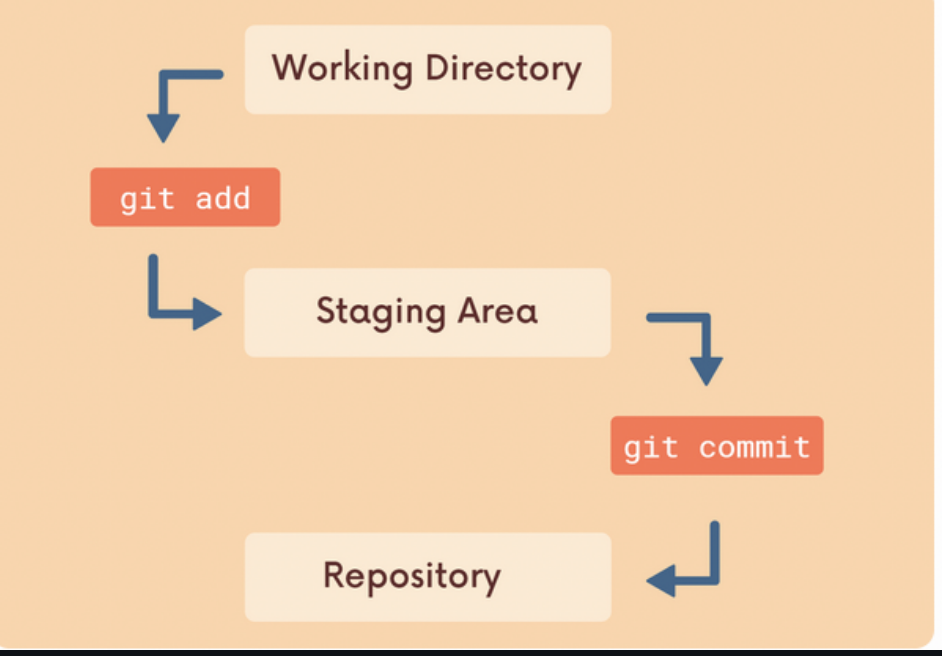

# Anki Interview Questions

**Q1**: What is a git repo ? 

**Solution**:

- workspace which *tracks* files within a folder

**Q2**:Describe the Committing workflow

 **Solution**:

Note ➡️ make it a cloze card 

**Solution**:

Make it a cloze overview