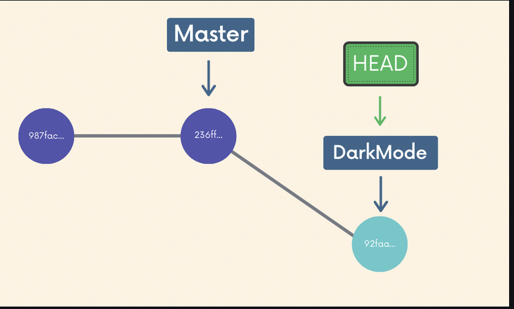
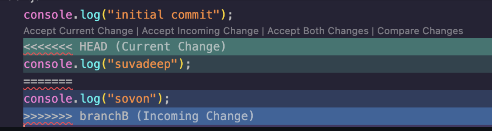

# Anki Interview Questions

**Q1**: What is a git repo ? 

**Solution**:

- workspace which *tracks* files within a folder

**Q2**:Describe the Committing workflow

 **Solution**:

Note ➡️ make it a cloze card 

**Solution**:

Make it a cloze overview

**Q3**: What is HEAD ? 

**Solution**:

- Each branch has a branch reference pointing to where we left called *branch pointer*
- **HEAD** is simply a pointer that refers to the current location in our repository .It points to a particular branch reference

**Q4**: We are trying to  merge branchB into master and there is  a conflict which lines are  coming from master and which lines are coming from branchB ?

**Solution**:

<<<<<<< From HEAD (Current Change) to =====  is the lines of code for our current branch and ====== to >>>>> branchB(Incoming Change) is the lines of code from the other branch and the conflict between the 2 branches is in line 2