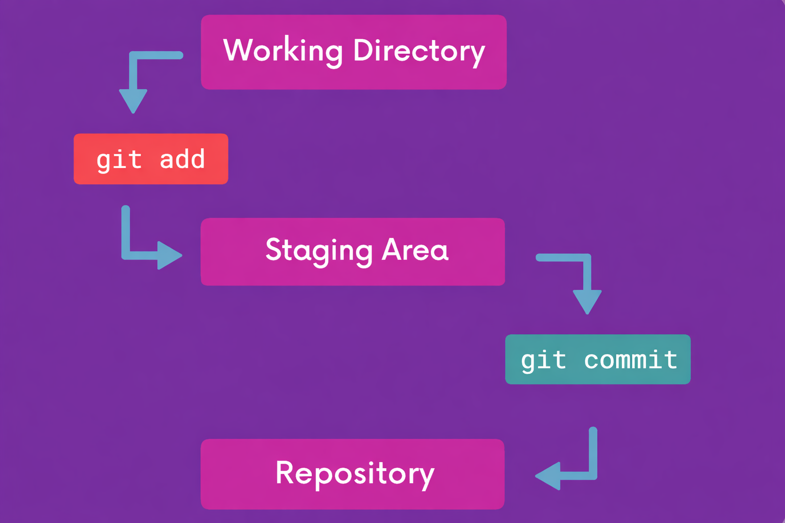

# Git & Github Cheat Sheet

## Git Configuration

- Check current git configuration (the effective value after local overrides global)
  - name : `git config user.name`
  - email : `git config user.email`
- Changing git configuration globally 
  - name : `git config --global user.name "suvadeep"`
  - email : `git config --global user.email "suvadeepm0709@gmail.com"`
- Changing git configuration locally 
  - name : `git config --local user.name "suva"`
  - email : `git config --local user.email "suva@gmail.com"`
  - Note ➡️ local configuration can only be checked inside a git repo 

- Check local configuration 
  - `git config --local --list`
- Check Global Configuration 
  - `git config --global --list`

## Adding and Committing

- Initializing a git repo 
  - `git init`
- Adding a file (say index.js) to staging area 
  - `git add index.js`
- Commit all files to the staging area 
  - `git add .`
- Commit all staged files with an inline commit message 
  - `git commit -m "message"`
- Checking git logs 
  - `git log`
  - `git log --oneline`
  - Note ➡️ If there are lots of git logs the command to exit pager : `q`
- Committing without any inline commit message 
  - `git commit`
  - Opens `$EDITOR`; commit **fails** if message is empty

- Ammending the last commit message 
  - `git commit --amend`

Note ➡️

- **Working Directory** is where files are edited.  **Staging Area** is where selected changes are prepared for commit using `git add`**Repository** stores committed snapshots using `git commit`

  

  

## Branches

- View your existing branches ➡️`git branch`
- To exit out of the window showing all the branches(if it shows in full screen)  ➡️`q`
- Create a new branch (does not switch to that branch) ➡️ `git branch branchName`
- Switch to an existing branch ➡️ `git switch branchName`
- Create and switch to a new branch ➡️ `git checkout branch -b branchName`
- Renaming a branch ➡️ `git branch -M newName`(We must be on the branch we want to rename)
- Deleting a branch ➡️ `git branch -d branchToDelete`
  - We cannnot delete a branch that's not fully merged 
  - We cannot delete the branch if we are on it 

## Merging Branches

- To merge 2 branches follow the few steps 
  - Switch to the branch you want to merge the changes into (the receiving branch) with `git switch`
  - Use `git merge` to merge changes from the specific branch into the current branch
- Fast Forward Merge 
  - A fast-forward merge can occur when there is a linear path from the current branch tip to the target branch
  - Instead of actually merging the branches , all Git has to do to  integrate the histories is move (i.e "fast forward") the current branch  tip up to the target branch tip!

- No conflict merges
  - git performs a merge commit
  - We end up with a new commit on the master branch
  - Git will prompt us for a commit message on our default code editor 
- Merges with conflicts
  - When you encounter a merge conflict ,Git warns you in the console that it could not automatically merge 
  - It also changes the contents of our files to indicate the conflicts that it wants you to resolve
  - Resolving Conflicts 
    - Open up the file(s) with merge conflicts
    - Edit the file(s) to remove the conflicts.Decide which branch's  content you want to keep in each conflict or keep the content from both
    - Remove the conflict "markers" in the document
    - Add your changes and then make a commit!

## Stashes

- Stashing 
  - stashing uncommitted changes so that we can return to them later
  - We can add multiple stashes onto the stack of stashes .They will all be stashed in the order we add them ➡️stack
- Take all uncommitted changes and stash them reverting the changes in our working directory ➡️ `git stash`
- **Removes** the most recently stashed changes in our stash and re-apply them in our working directory ➡️ `git stash pop`
- Apply whatever is stashed without removing it from the stash (most recent) ➡️ `git stash apply`
- Viewing stashes ➡️ `git stash list`
- Applying a particular stash (say stash@{2}) ➡️ `git stash apply stash@{2}`
- Clearing the stash ➡️`git stash clear`
- Dropping a particular stash (say stash@{2}) ➡️`git stash drop stash@{2}`
- Stashing with a comment ➡️ `git stash push -m "WIP:refactor auth logic"`

##  Undoing Changes

- View the contents of an old commit 

  - `git checkout commit-hash` (This will put us in detached HEAD)

- detached HEAD 

  - HEAD is a pointer to the current branch reference (branch reference is a pointer to the last commit made on a particular branch)
  - When we do `git checkout commit-hash` HEAD points at that commit rather than at the branch pointer

- To reattach detached HEAD

  - `git switch -` ➡️ This will switch back to wherever we were before

- Restore the contents of a file to the state they were at the last commit ➡️ `git restore file`

- Reset the repo back to a specific commit (only the commits are gone , changes are there) ➡️`git reset commit-hash`

- Reset the repo back to a specific commit(both the commits and changes are gone)➡️ `git reset --hard commit-hash`

- `git reset` vs `git revert`

  - reset moves the branch pointer backwards eliminating commits
  - revert creates a brand new commit which reverses the changes from a commit (Because it results in a new commit we will prompted to enter a commit message)

## Github

- Cloning a repo 
  -  `git clone <URL>`
  - Example ➡️ `git clone https://github.com/pytorch/pytorch`
- Viewing Remotes
  - `git remote`
  - `git remote -v`
- Adding a new remote 
  - `git remote add <name> <URL>`  
  - Example  
