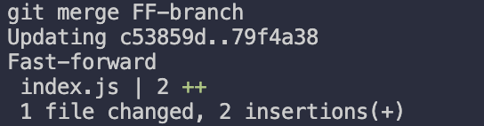

# Code Along

## Git Configuration 

**Q1**:Code Along

1. Check the current git configuration (the effective value after local overrides global)
2. Change the git configuration globally 
3. Check the git configuration again (the effective value after local overrides global)
4. Now Change the git configuration locally 
5. Check the local configuration and   global  configuration 

**Solution**:

- **Current git configuration**(effective value after local overrides global):
  - `name : `git config user.name
  - `email : `git config user.email`
- **Change git configuration globally** 

  - name : `git config --global user.name "suvadeep"`
  - email : `git config --global user.email "suvadeepm0709@gmail.com"`
- **Check git configuration again**:
- name :`git config user.name`
  
- email : `git config user.email`
- **Change git configuration locally**

  - name : `git config --local user.name "suva"`
  - email : `git config  --local user.email "suva@gmail.com"`
  - Note ➡️ `git config --local user.name` only works inside a git repository
- **Check local configuration and global configuration**:

  - local configuration ➡️ `git config --local --list`
  - global configuration ➡️`git config --global --list`

Note ➡️ Local git configuration overrides global configuration 

## Basic Terminal Commands

**Q1**: Code Along

- List all files in the current directory
- List all files in a specific subdirectory
- Print current working directory
- Change folder to another directory
- Go up one directory
- Create a file called `index.js`
- Create a folder called `playground`
- Delete the file `index.js`
- Delete the folder `playground`
- List all files including hidden files

**Solution**:

- **List files in the current directory**
  - `ls`
- **List files in a specific subdirectory**
  - `ls <dir>`
- **Print current working directory**
  - `pwd`
- **Change folder to another directory**
  - `cd <directory>`
- **Go up one directory**
  - `cd ..`
- **Create a file called `index.js`**
  - `touch index.js`
- **Create a folder called `playground`**
  - `mkdir playground`
- **Delete the file `index.js`**
  - `rm index.js`
- **Delete the folder `playground`**
  - `rmdir playground`
  - (or `rm -rf playground` if the folder is not empty)
- **List all files including hidden files**
  - `ls -a`

##  Adding and Committing

### Adding and Committing

**Q1**: Code Along

- Make a folder called `temp`
- Move into the `temp` folder
- Initialise a Git repository
- Create 3 files `index.js`, `app.js`, `server.js`
- Add `index.js` to the staging area
- Check Git status
- Add `app.js` and `server.js` to the staging area with one command
- Check Git status again
- Commit all staged files with an inline commit message
- Check the logs both inline and detailed

**Solution**:

- Make a folder called `temp`
  - `mkdir temp`
- Move into the folder
  - `cd temp`
- Initialise Git repository
  - `git init`
- Create files
  - `touch index.js app.js server.js`
- Add `index.js` to staging area
  - `git add index.js`
- Check Git status
  - `git status`
- Add `app.js` and `server.js` to staging area
  - `git add app.js server.js`
- Check Git status again
  - `git status`
- Commit staged files with inline message
  - `git commit -m "add index.js, app.js and server.js"`
- Check git logs
  - one line : `git log --oneline`
  - detailed: `git log`

**Q**: Simulate entering and exiting Vim 

- Make a temporary folder `temp`
- cd into temp 
- make a file `hello.txt`
- open `hello.txt` with `vim hello.txt`
- Inside the editor write a message `Hello Vim`
- exit vim

**Solution**:

- make a temporary folder `temp` ➡️ `mkdir temp`
- cd into temp ➡️ `cd temp`
- make a file `hello.txt` ➡️ `touch hello.txt`
- `vim hello.txt`
- Vim Commands 
  - i ➡️ enter insert mode
  - Write `Hello Vim`
  - To exit vim ➡️ `Esc` the `:wq⏎ `
  - Tricks : ✅ **I Easily Eat Worms Quickly** ➡️`i`➡️Enter Commit Message ➡️ `ESC` ➡️ `:wq` ⏎

**Q**: Simulating Commit messages in default editor

- Create a temp folder called `temp`
- Change folder to `temp`
- Create  a file called `index.js`
- Open folder with Vs Code
- Edit `index.js` 
- Commit without inline message make the commit message `initial`
- Amend the commit message to be `initial commit`
- Check logs 

**Solution**:

- Creating a temp folder called `temp` ➡️ `mkdir temp`
- Change folder to `temp` ➡️ `cd temp`
- Create a file called `index.js` ➡️ `touch index.js`
- Open folder with Vs Code ➡️ `code .`
- Commit without inline message make the commit message `initial` ➡️ `git init`,`git add .`,`git commit` , Write in default editor `initial`
- Amend the commit message to be `initial commit` 
  - `git commit --amend`
    - This will open up default editor
    - Change `initial` to `initial commit`
    - Close the default editor  
- Check git logs ➡️`git log --oneline`

## Branches

**Q**: Code Along 

- make a folder called `temp` and move to that folder , `git init` that folder 
- Make some random commit 
- Create a new branch `branch1` without switching to it 
- Switch to `branch1`
- View all existing branches 
- Create 2 new branches `branch2` and `branch3` each with a single command 
- Rename branch `branch1` to `branchA`
- Delete the branch `branch3`

**Solution**:

- `mkdir temp` , `cd temp` , `git init`
- Make some random commit ➡️ `touch index.js`, `git add .` , `git commit -m "initial commit"`
- Create a new branch `branch1`  ➡️ `git branch branch1`
- Switch to branch1 ➡️ `git switch branch1`
- View all existing branches ➡️ `git branch`
- Create 2 new branches `branch2` and `branch3` each with a single command ➡️ `git checkout -b branch2` , `git checkout -b branch3` 
- Rename branch `branch1` to `branchA` ➡️ `git branch -M branchA` ( We must be on the branch we want to rename)
- Delete the branch `branch3` ➡️ `git branch -d branch3`

**Q**: Demo of fast forward merges 

- Create a `temp` folder and `cd` into it
- Open it with VS Code
- Create a file called `index.js` , write something in it and commit it like `console.log("Hello World")` on the first line
- Create a new branch and directly switch to that branch in a single command ,name in FF-branch
- Create 2 new commits on the `FF-branch`, add the following 2 lines `commit 1 on FF` , `commit 2 on FF` on the second and third line respectively  
- Switch back to `master` branch
- Merge FF-branch to master 

**Solution**:

- Create a `temp` folder and `cd`  into it ➡️ `mkdir temp` and `cd temp` 
- Open it with VS Code ➡️ `code .`
- Create a file called `index.js` , write something in it and commit it like `console.log("Hello World")` on the first line ➡️ Follow the instructions
- Create a new branch and directly switch to that branch in a single command ➡️ `git checkout -b FF-branch`
- Create 2 new commits on the `FF-branch`, add the following 2 lines `commit 1 on FF` , `commit 2 on FF` on the second and third line respectively   ➡️ Follow the instructions
- Switch back to `master` branch ➡️ `git switch master`
- Merge FF-branch to master ➡️ `git merge FF-branch`

**Q**: Demo of merges with no conflicts

-  Create a rep `git-merge-no-conflict`
- Open it with VS Code 
- Create a file called `master.txt` and write `line 1 on  master` on it and then commit it with the message "initial commit"
- Create a new branch called `feature` 
- Create a file called `feature.txt` and write Feature  work on it and then commit it with the message "add feature file"
- Switch back to `master`
- Add the text `line 2 on master` in the file `master.txt`, add it and commit it 
- Merge feature into master

**Solution**:

- Create a rep `git-merge-no-conflict` ➡️`mkdir git-merge-no-conflict` , `cd git-merge-no-conflict` , `git init`
- Open it with VS Code ➡️ `code .`
- Create a file called `master.txt` and write `line1 on master` on it and then commit with the commit message `line1 on master` ➡️ Follow the instructions
- Create a new branch called `feature` ➡️ `git checkout -b feature`
- Create a file called `feature.txt` and write Feature  work on it and then commit it with the message "add feature file" ➡️ Follow the instructions
- Switch back to master ➡️ `git switch master` 
- Add the text `line 2 on master` in the file `master.txt`, add it and commit it with the commit message `line 2 on master`   ➡️ Follow the instructions
- Merge feature into master ➡️ `git merge feature`, give the commit message in your default editor and the merge is done

**Q**: Demo of merge with conflicts 

- Create a repo `git-merge-conflict` , open it in VS Code
- Create a file `file.txt` and write `Hello from master` on it , add it and commit it with the message "initial commit on master "
- Create a branch called `feature`
- Change `Hello from master` to `Hello from feature` , commit it with the message `feature change greeting`
- Switch back to master
- Modify the same line on master to "Suvadeep Mukherjee" , commit it with the commit message "master changes greeting"
- Merge feature into master (conflict)
- fix the conflicts keep the incoming changes
- Add the file then commit it

**Solution**: 

- Create a repo `git-merge-conflict` ➡️ `mkdir git-merge-conflict` , `cd git-merge-conflict` , `git init` , `code .`
- Create a file `file.txt` and write `Hello from master` on it , add it and commit it with the message "initial commit on master " ➡️ Follow the instructions
- Create a branch called feature ➡️ `git checkout -b feature`
- Change `Hello from master` to `Hello from feature` commit it with the message `feature change greeting` ➡️ Follow the instructions
- Switch back to master ➡️ `git switch master`
- Modify the same line on master to "Suvadeep Mukherjee" , commit it with the commit message "master changes greeting" ➡️ Follow the instructions
- Merge feature into master(conflict) ➡️ `git merge feature`
- fix the conflicts keep the incoming changes ➡️ Follow the instructions

## Stashing

**Q**: Stashing Demo 

- git init a practise repo `git-stash-lab` and then open it with VS Code
- Add a file `app.js` , add the line `console.log("version 1")`, then commit it with the message "initial commit"
- Add Uncommitted changes like `console.log("version 2")`
- Stash those changes
- Add Uncommitted changes again like `console.log("version 3")`
-  stash those changes with a message 
- Add uncommitted changes like `console.log("version 4")` then stash them with no messages
-  List all the stashed changes
- apply the latest stash without removing it from the stash then again stash it
-  Now apply the latest stash but this time remove it from the stash  then again stash it
- List all the stashes and then apply `stash@{2}`
- Stash the changes again
- List all the stash  and drop `stash@{3}`
- Clear the stash

**Solution**:

- git init a practise repo `git-stash-lab` ➡️ `mkdir git-stash-lab` , `cd git-stash-lab` , `git init`, `code .`
- Add a file `app.js` , add the line `console.log("version 1")`, then commit it with the message "initial commit" ➡️ Follow the instructions
- Add Uncommitted Changes ➡️ Follow the instructions
- Stash those changes ➡️ `git stash`
- Stash those changes with a message ➡️`git stash -m "WIP : console.log("version 3)"`
- Add uncommitted changes like `console.log("version 4")` then stash them with no messages ➡️ Follow the instructions
- List all the stashed changes ➡️ `git stash list`
- apply the latest stash without removing it from the stash ➡️ `git stash apply`, `git stash`
- Now apply the latest stash but this time remove it from the stash  ➡️`git stash pop`,`git stash`
- List all the stashes and then apply `stash@{2}` ➡️`git stash list` , `git stash apply stash@{2}`
- Stash the changes ➡️ `git stash`
- List all the stash  and drop `stash@{3}` ➡️`git stash list` , `git stash drop stash@{3}`
- Clear the stash ➡️ `git stash clear`

