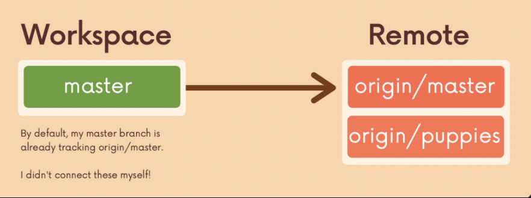

# Cheat Sheet

## Cloning a repo 

-  `git clone <URL>`
-  Example ➡️ `git clone https://github.com/pytorch/pytorch`

##  Remotes

- Viewing Remotes
  - `git remote`
  - `git remote -v`  (`v` stands for verbose so it gives more information)

- Adding a new remote 

  - `git remote add <name> <URL>`  
  - Example  : `git remote add origin github.com/SuvadeepMukherjee/cute-cats-serverless`
- Renaming a remote ➡️ `git remote rename <old> <new>`
- Removing a remote ➡️ `git remote remove <name>`

## Push

- `git push <remote> <branch> ` 
  -  This will push our local branch to the branch on remote, example : `git push origin master` will push our local master branch to the remote(origin) master branch
- `git push <remote> <local-branch> :<remote-branch>`
  -  pushes a local branch to a remote branch of different name  for example `git push origin pancake:waffle` will push our local pancake branch up to a remote branch called waffle
- The `-u` option
  - The `-u` option allows us to set the upstream of the branch we are pushing
  - `git push -u origin master` sets the upstream of the local master branch so that it tracks the master branch on the origin repo , next time we can use `git push`

## master vs main

- Github has default branch as main
- git has default branch as master   

## Remote Tracking branch

- a reference to the state of a branch on the remote , we can't move this ourself , at the time we last communicated with the remote this is where the particular branch was referencing on the remote

- They follow this pattern <remote>/<branch> 

- `origin/master` references the state of the master branch on the remote repo named origin

- `upstream/logoRedesign` references the state of the logoRedesign branch on the remote named upstream (a common remote name)  

- To view remote tracking branches : `git branch -r`

- Checking out on remote tracking branches : `git checkout origin/master` , this will put us in detached HEAD 


## Common Confusion 

- When we clone a repo from GitHub, the local master branch automatically tracks `origin/master`.

- Other remote branches are not tracked locally by default.

- If we want a local branch called `puppies` that is connected to `origin/puppies`,
  we can run `git switch puppies`.
  
- This creates a new local branch from the remote branch and sets it to track `origin/puppies`.

   	

## Fetch

- Keeping Local Repo Up to Date (Without Merging)
- Fetch does NOT change local branches or the working directory
- Commands 
  - `git fetch <remote> <branch> 
    - fetch a specific branch from the specific remote
    - updates the remote tracking branch of that particular branch
  - `git fetch <remote>`
    - fetch all the  branches from that specific remote
    - updates all the remote tracking branches of that particular remote
  - `git fetch`
    - fetch all the  branches from origin
    - updates all the remote tracking branches of that remote

## Pull

- go and download data from Github and immediately update my local repo with those changes
- Changes are merged into the branch you are currently on 
- Because pull performs a merge, it can result in merge conflicts
- Commands 
  - `git pull <remote> <branch> `
    - will pull all the changes from that particular branch of that remote and merge those chages into our local branch
  - `git pull <remote>`
    - branch will default to whatever tracking connection is configured for our current local branch
  - `git pull`
    - branch will default to whatever tracking connection is configured for our current local branch
    - remote will default to origin  

## Centralized Workflow

- Everyone works directly on `main/master`.
- Simple, but causes frequent merge conflicts, broken main branch, and prevents safe experimentation.

## Feature Branches

- New development is done on separate branches.
- `main/master` is treated as stable project history.

## Merging Feature Branches

- Feature branch work is eventually merged into `main/master`.
- Merging can be done directly or after discussion, but **Pull Requests are the most common approach**.

## Pull Request Workflow 

- Do some work locally on a feature branch
- Push up the feature branch to Github
- Open a pull request using the feature branch just pushed up to Github 

## Merging Pull Requests with Conflicts

- To resolve the conflict locally:

  - Switch to the branch in question. Merge in master and resolve the conflicts

    ```
    git fetch origin 
    git switch my-new-feature 
    git merge master 
    # fix conflicts!
    ```

  - Switch to master. Merge in the feature branch (now with no conflicts). Push changes up to Github

  - ```
    git switch master 
    git merge my-new-feature
    git push origin master
    ```

## Fork and Clone Workflow

- Commonly used in open source projects 

- The Fork and Clone Workflow

  - **Fork** the repo you want on Github

  - **Clone** the repo down to your local machine, the `origin` will be your own forked repo

  - Add a remote pointing to the **original repo**, i.e., `upstream` pointing to the original repo

    - Thus, if there are changes (commits, PR merges, …) made to the original repository, we can pull those changes down

    - ```
      git remote add upstream <original-url>
      ```

- Make changes and add/commit on a feature branch on your local machine
- Push up new feature branch to `origin` (your forked repo)
- Open a **pull request** to the original project repo containing the new work on your forked repo